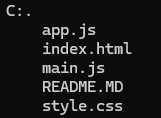

## HOLLYWOOD

Hollywood es una plataforma que le permite buscaar y visualizar las peliculas y series que el usuario necesite consultar a manera de vista de un panel 

## Estrucuta del repositorio

El repositorio consta de 5 carpetas: 

    1. app.js: contiene el codigo de mostrar las cosas de la pagina 
    2. image.png: contiene la imagen del readme
    3. index.html: estructuracion del codigo
    4. Main.js: Funcionalidad de todos los botones
    5. styles.css: estilos de la pagina

## Esctructura

## lenguajes usados

- Javascript
- css
- HTML5

## Instalación
1. clonar el repositorio 
2. abrir visual y pegarlo 
3. open live server

## Credito 

Este repositorio fue elaborado por Zully Fernanda Ortiz Avendaño